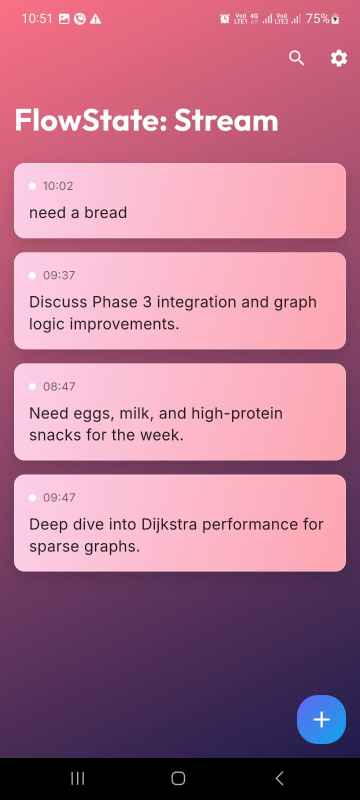
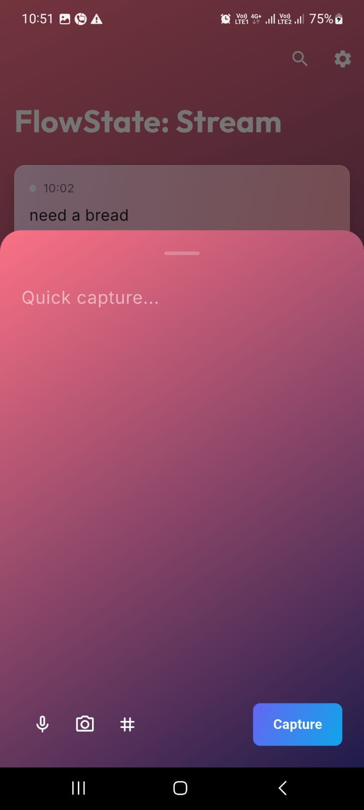
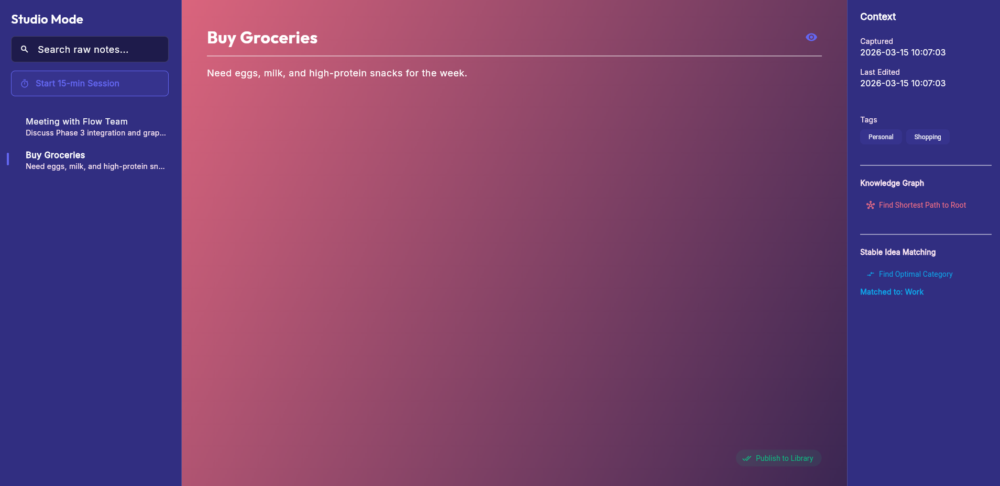

  
  
  
  
  
  

  
  
  
  

---

# 🌊 FlowState

> **Capture anywhere. Organize everywhere. Know everything.**

FlowState is an **Adaptive Cross-Platform Knowledge Pipeline** built with Flutter — designed to permanently solve the problem of the **"Digital Graveyard"**: the pile of unsorted notes and voice memos that are captured on mobile and never seen again.

The system gives every device a specific, intentional job in a structured workflow. Ideas flow from **chaotic capture** on mobile → **deep processing** on desktop → **clean knowledge** on the web — without friction, without loss, without overwhelm.

---

## ✨ Key Features

| Feature | Description |
|---|---|
| 📱 **Device-Adaptive Views** | Three completely different UIs for Mobile, Desktop, and Web — each optimized for one job. |
| 🧠 **CS Algorithm Engine** | Four Computer Science algorithms actively power Smart Review, Knowledge Graph, Auto-Categorization, and Note Sorting. |
| 🌳 **Hierarchical Tag System** | A Trie-based tag engine supports nested tags (`Work/Projects/FlowState`) with instant autocomplete. |
| ⚡ **Smart Review Mode** | Knapsack algorithm selects the highest-value notes that fit within a 15-minute review session. |
| 🗺️ **Knowledge Graph** | Dijkstra's algorithm finds the shortest conceptual path between any two linked notes. |
| 🎯 **Note Pipeline States** | Notes progress through `Raw → Processing → Library`, gating what each platform sees. |
| 🎨 **Vibrant Dark Theme/ Light Theme** | Rose-to-Indigo gradient design system with Google Fonts (Outfit + Inter) and micro-animations. |
| ☁️ **MongoDB-Ready Architecture** | Repository Pattern cleanly separates the data layer — ready for MongoDB Atlas cloud sync in Phase 2. |

---

## 🎬 Project Demonstration

The following resources demonstrate FlowState's behavior in detail:

- 📸 [Screenshots](#-screenshots) — Mobile, Desktop, and Web views
- ⚙️ [Architecture Overview](#️-architecture-overview) — System design and project structure
- 🧠 [Engineering Decisions](#-engineering-decisions) — Key technical trade-offs
- 🔧 [Design Decisions](#-design-decisions) — UX and visual design rationale
- 🗺️ [Roadmap](#️-roadmap) — Current feature status and upcoming phases
- 📄 [Documentation](#-documentation) — Full extended docs in `/docs`
- 📩 [Contact](#-contact) — Get in touch

---

## 📹 Product Walkthrough

*A comprehensive video or GIF walkthrough demonstrating the adaptive UX, Algorithm Engine, and core pipeline workflow is coming soon.*

---

## 📸 Screenshots

> **Mobile** — `CaptureView`: Minimalist raw note stream for frictionless idea capture.

  

---

> **Mobile** — Quick Capture Sheet: Bottom-sheet modal with instant keyboard focus.

  

---

> **Web** — `PortalView`: A clean, searchable grid showing only processed, library-state notes.

  

---

## ⚙️ Architecture Overview

FlowState uses a **Feature-First Layered Architecture** combined with the **Repository Pattern** for database independence.

The folder structure is intentionally split to decouple pure Dart logic (algorithms/data structures) from Flutter UI components, organized by feature.

### Layered Responsibilities
- **Presentation Layer (`views/`)** — Renders UI, listens to Riverpod streams. No business logic.
- **State Layer (`providers/`)** — Riverpod `StreamProvider` and `StateProvider`. Manages live data.
- **Domain Layer (`core/`, `models/`)** — `Note` entity, `NoteState` enum, and the CS Algorithm Engine.
- **Data Layer (`providers/*_repository.dart`)** — Clean interface (`NotesRepository`) allowing hot-swapping between Isar (native) and Web (in-memory) engines without UI changes.

### Platforms
- **Mobile** `Android/iOS` — Quick capture stream with FAB and bottom-sheet modal.
- **Desktop** `Windows/macOS/Linux` — Three-column Studio with markdown editor, queue, and knowledge graph.
- **Web** `Chrome/Browser` — Searchable knowledge portal with masonry grid.

### CS Algorithm Engine (`lib/core/algorithms/`)
| Algorithm | Applied Feature | Complexity |
|---|---|---|
| Dijkstra's Shortest Path | Knowledge Graph path finding | O((V + E) log V) |
| 0/1 Knapsack | Smart 15-min Review session optimizer | O(n × W) |
| Gale-Shapley (Stable Matching) | Auto-categorize notes to topics | O(n²) |
| MergeSort (Multi-key) | Note queue priority sort | O(n log n) |

### Data Structures (`lib/core/data_structures/`)
- **TagTree** — Hierarchical Tree for nested tag autocomplete (`Work/Projects/FlowState`).
- **FlowLinkedList** — Doubly linked list for O(1) insert/remove in the capture stream.

### State Management
Riverpod 2.x with typed providers — `StreamProvider` wraps Isar's reactive watch streams, delivering real-time UI updates without manual refresh.

> ⚠️ **Temporary Databases**: Isar Community DB (native) and an in-memory web repository.
> **MongoDB Atlas** will replace both in Phase 2 as the single cloud source of truth.

📄 Full technical detail: [`docs/ARCHITECTURE.md`](docs/ARCHITECTURE.md)

---

## 🧠 Engineering Decisions

A summary of the most impactful engineering choices made during development:

1. **Single Codebase, Three Distinct UXs** — Flutter compilation targets used to render entirely different widget trees per platform, not just responsive layouts.
2. **Repository Pattern for Database Abstraction** — A clean `NotesRepository` interface allows swapping Isar → MongoDB Atlas with zero changes to UI or business logic.
3. **CS Algorithms as Active Features** — Each algorithm powers a real, user-facing feature rather than being a conceptual demonstration.
4. **Conditional Import for Platform Divergence** — Compile-time platform selection via Dart's `import 'A.dart' if (dart.library.html) 'B.dart'` — no runtime `kIsWeb` branching in business logic.
5. **Hierarchical Tag Trie** — Tags stored as path strings and indexed via a Trie for O(k) lookups and O(n) prefix suggestion traversal.

📄 Deep technical rationale: [`docs/ENGINEERING_DECISIONS.md`](docs/ENGINEERING_DECISIONS.md)

---

## 🔧 Design Decisions

A summary of the key UX and visual design decisions that shaped each view:

1. **Three Separate Views, Not One Responsive Layout** — Every platform has one intentional job; a unified layout would compromise all three.
2. **Vibrant Dark Theme** — Rose-to-Indigo gradients signal energy and momentum, reinforcing the "flow state" brand promise for focused users.
3. **NoteState as the Visual Pipeline** — The `raw → library` progression makes ideas visible and creates healthy productive pressure.
4. **Quick Capture as a Bottom Sheet** — Reduces friction to near-zero with auto-focus keyboard and swipe-to-dismiss, keeping the note stream visible in context.
5. **Multi-Pane Studio Layout** — Desktop's three-column design maps directly to the "inbox → focus → context" mental model.

📄 Full UX rationale: [`docs/DESIGN_DECISIONS.md`](docs/DESIGN_DECISIONS.md)

---

## 🗺️ Roadmap

| Status | Feature | Description |
|---|---|---|
| ✅ Done | Platform-Adaptive UI | Mobile, Desktop, Web views with `AdaptiveScaffold` |
| ✅ Done | Isar Offline-First DB | Temporary local database for native platforms |
| ✅ Done | Vibrant Gradient Theme | Rose-Indigo dark theme with Google Fonts |
| 🔄 In Progress | Note Pipeline (`raw → library`) | `NoteState` enum gating what each platform shows |
| 🔄 In Progress | Algorithm Engine | Dijkstra, Knapsack, Gale-Shapley, MergeSort |
| 🔄 In Progress | TagTree (Hierarchical Trie) | Nested tag autocomplete system |
| 🔄 In Progress | MongoDB Atlas Cloud Integration | Replace temp DBs; real-time cross-device sync |
| ⬜ Not Started | Voice Note Capture | Audio recording on mobile |
| ⬜ Not Started | Knowledge Graph Visualization | Interactive node/edge graph in Studio |

📄 Full phased roadmap: [`docs/ROADMAP.md`](docs/ROADMAP.md)

---

## 🚀 Future Improvements

- 📡 **MongoDB Change Streams Push** — Desktop publish → Mobile inbox updates instantly via real-time change streams.
- 🗂️ **Obsidian Export** — Export the library as a `.md` vault compatible with Obsidian.
- 👥 **Team Mode** — Shared note pipelines for collaborative knowledge management.
- 🍎 **iOS + macOS** — Native compilation for Apple ecosystem targets.
- ⏰ **Contextual Reminders** — "You have 3 notes uncaptured for 24h — process them now."

---

## 📄 Documentation

| Document | Description |
|---|---|
| [ARCHITECTURE.md](docs/ARCHITECTURE.md) | Full technical architecture — layers, providers, algorithm integration, DB strategy |
| [ENGINEERING_DECISIONS.md](docs/ENGINEERING_DECISIONS.md) | 8 key engineering trade-offs with detailed reasoning and outcomes |
| [DESIGN_DECISIONS.md](docs/DESIGN_DECISIONS.md) | 8 UX and visual design decisions — from theme rationale to interaction patterns |
| [ROADMAP.md](docs/ROADMAP.md) | Phased feature roadmap — Phase 1 (done), Phase 2 (MongoDB Atlas), Phase 3 (AI) |
| [CONTRIBUTING.md](docs/CONTRIBUTING.md) | Developer conventions, directory rules, and pipeline integrity contract |

---

## 📝 License

This repository is published for **portfolio review and educational purposes only**.

The source code, architecture, and design may not be accessed, copied, modified, distributed, or used in any commercial or personal project without explicit written permission from the author.

© 2025–2026 Viraj Tharindu — All Rights Reserved.

---

## 📩 Contact

If you are reviewing this project as part of a hiring process, technical evaluation, or are interested in the engineering approach behind FlowState, feel free to reach out.

I would be happy to walk through the architecture, discuss specific design decisions, or provide a private live demonstration.

**Opportunities for collaboration or professional roles are always welcome.**

📧 **Email**: [virajtharindu1997@gmail.com](mailto:virajtharindu1997@gmail.com)  
💼 **LinkedIn**: [viraj-tharindu](https://www.linkedin.com/in/viraj-tharindu/)  
🌐 **Portfolio**: [vjstyles.com](https://vjstyles.com)  
🐙 **GitHub**: [VirajTharindu](https://github.com/VirajTharindu)  

---

  <em>🌊 FlowState — Where your ideas stop being forgotten and start becoming knowledge.</em>

